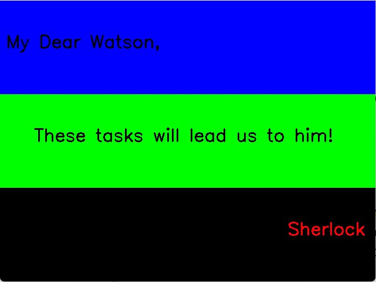

# Sherlock's Message Decoding - GitHub Repository

## Introduction
Detective Sherlock has left a secret message for his assistant Dr. Watson while tracking his arch-enemy Professor Moriarty. This repository contains the code and results for decoding the hidden message in the image. The original image can be found in the `data` folder of the Overleaf project.

## Task 1: Decoding Sherlock's Message (1pt)
### Results
The decoded image revealing the secret message can be found in the `results` folder.

### Code Explanation
The code is designed to decode a hidden message by manipulating the Hue, Saturation, and Value (HSV) values of the image. The primary steps are as follows:

1. **Required Libraries:**
   - OpenCV: For computer vision tasks.
   - NumPy: For numerical operations.

2. **Interactive Thresholding using Trackbars:**
   - Sets up an interactive window using OpenCV's trackbar functionality.
   - Allows the user to manually select HSV ranges using trackbars to isolate specific parts of the image based on color.

3. **Inside the Loop:**
   - Fetches HSV values from the trackbars.
   - Creates a mask using these HSV values.
   - Uses bitwise operations to retain parts of the image within the specified HSV range, setting others to black.
   - Displays the thresholded image in the window.
   - If HSV values change, they are printed to the console for user feedback.
   - The loop continues until the 'q' key is pressed, closing the window.

4. **Values for Decoding:**
   - The values at which the encoded message was revealed are:
     - Hue: 1 to 179
     - Saturation: 255
     - Value: 0 to 255

### Code Location
The code for decoding Sherlock's message can be found in the file: `Homework 1/Q2/HW1_Q2.py`

## Usage
1. Clone this repository.
2. Navigate to the `Sherlock-Detection---HSV` directory.
3. Run the Python script `sherlock detection.py`.

## Author
- Name: Ashiq Rahman Anwar Batcha
